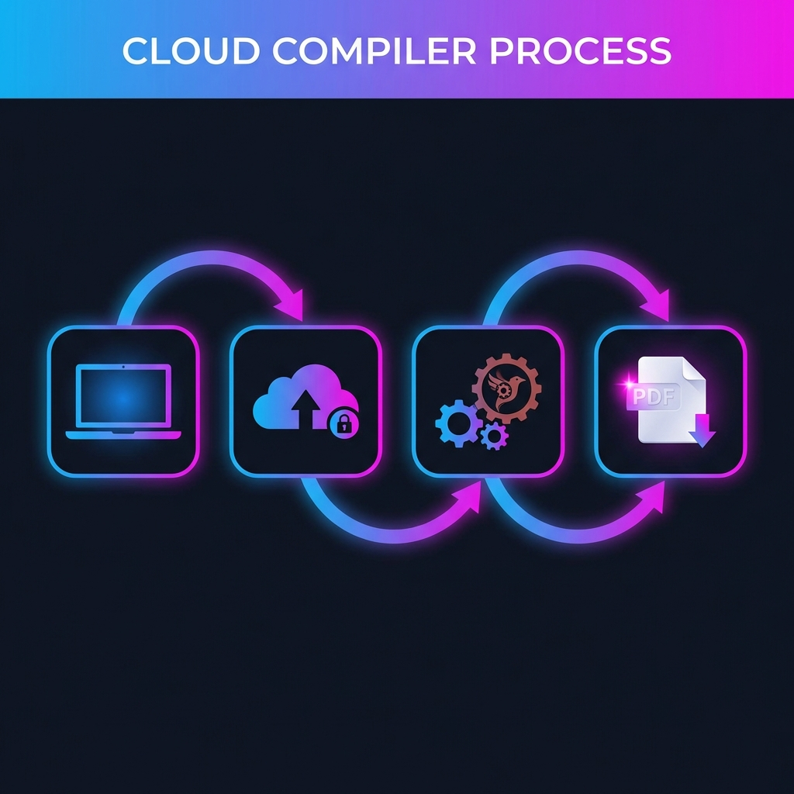

# 🌀 qtex CLI

<p align="center">
  
</p>

<p align="center">
  <a href="https://www.npmjs.com/package/qtex"></a>
  <a href="./LICENSE"></a>
  <a href="https://latex.taptapp.xyz"></a>
  <a href="https://latex.taptapp.xyz"></a>
</p>

---

**qtex CLI** is an ultra-fast, cloud-powered LaTeX compiler designed for developers who value speed and simplicity. Say goodbye to heavy local TeX distributions like TeXLive or MikTeX. Compile your documents in the cloud with sub-second latency and real-time feedback.

---

## 🚀 Key Features

*   **⚡ Lightning Fast**: Powered by the Rust-based Tectonic engine, optimized for "moonshot" speed.
*   **📦 Zero-Config**: No local dependencies required. Just run and compile.
*   **👀 Smart Watch Mode**: Automatically detects changes in `.tex`, `.bib`, `.sty`, and even **images** (`.png`, `.jpg`, `.jpeg`) to recompile in milliseconds.
*   **🔍 Intelligent Validation**: Pre-flight checks on the API to catch syntax errors before the full compilation process.
*   **📂 Recursive Project Support**: Handles complex multi-file projects, including nested asset folders.

---

## 🧠 How it Works

<p align="center">
  
</p>

1.  **Local Scan**: qtex recursively discovers all required assets (TeX, styles, images) in your project.
2.  **Pre-flight Audit**: Sends a lightweight version to the `/validate` endpoint for immediate syntax feedback.
3.  **Cloud Compilation**: Ships project files via high-speed multipart streams to the **Tachyon-Tex** cloud infrastructure.
4.  **Instant Sync**: Downloads and saves the resulting PDF locally, reflecting changes almost instantly.

## 🚀 Quick Start

You can use **qtex** immediately without installation via `npx`, or install it globally for frequent use.

### Option 1: Use with npx (Zero Installation)
The easiest way to get started. No need to install anything:

```bash
npx qtex ./my-project
```

### Option 2: Global Installation via npm
For the best experience if you have Node.js:
```bash
npm install -g qtex
```

### Option 3: Standalone Installation (Recommended)
Install the binary directly without Node.js or npm. Copy and paste into your terminal:

**macOS / Linux:**
```bash
curl -fsSL https://raw.githubusercontent.com/srsergiolazaro/qtex/bun-bundle/install.sh | bash
```

**Windows (PowerShell):**
```powershell
irm https://raw.githubusercontent.com/srsergiolazaro/qtex/bun-bundle/install.ps1 | iex
```

Once installed, you can simply run:
```bash
qtex ./my-project
```

---

## 🛠️ Commands & Options

### Watch Mode (Live Recompilation)
The `--watch` flag monitors your directory and recompiles instantly on any save:

```bash
# Using npx
npx qtex ./my-project --watch

# Using global install
qtex ./my-project --watch
```

### Custom Output
Define a specific filename for your generated PDF:

```bash
qtex ./my-project --output thesis_final.pdf
```

### Help
See all available options:

```bash
qtex --help
```

---

## 📡 Infrastructure & API

qtex serves as the official CLI client for the **Tachyon-Tex** infrastructure:

*   **Endpoint**: `https://latex.taptapp.xyz`
*   **Engine**: Tectonic (Rust / XeTeX)
*   **Privacy**: Stateless and ephemeral. Project data is processed in-memory and never stored.

---

## ⚖️ License

This project is licensed under the **Fair Source License**.
*   **Individual/Small Teams**: Free to use for individuals and organizations with up to 3 concurrent users.
*   **Enterprise/Large Scale**: For use beyond 3 users, please contact us for a commercial license.

For more details, see the [LICENSE](./LICENSE) file.

---

Built with ❤️ by the **Tachyon-Tex** team. Optimized for modern LaTeX workflows.
